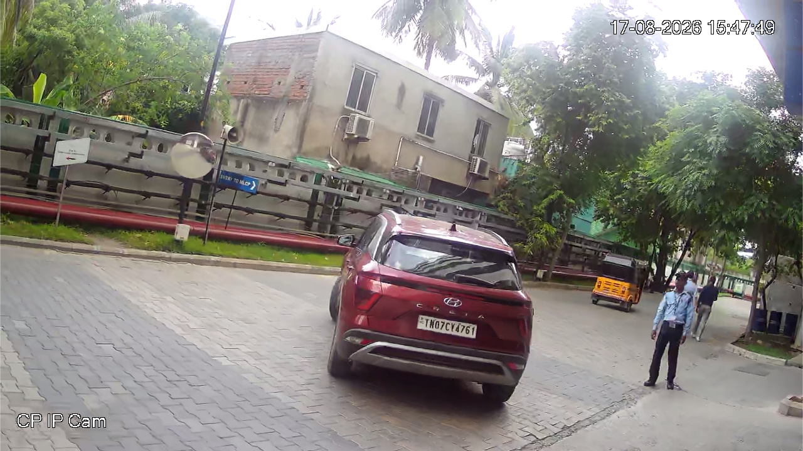
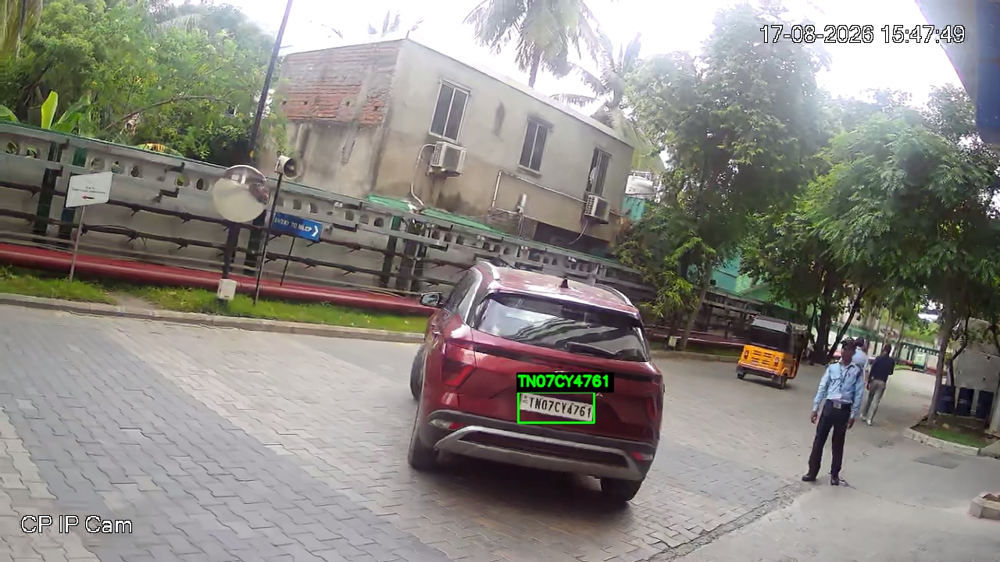

# Automatic Number Plate Recognition with YOLOv8 and PaddleOCR

A Python computer vision project that detects vehicle number plates in images, reads their text, and exports annotated images, plate crops, and structured JSON results. It also includes an optional smoke detection branch.

**Implementation note:** The repository is named `ANPR-YOLO-EasyOCR` and the notebook is named `ANPR_EasyOCR.ipynb`, but the current code uses **PaddleOCR**, not EasyOCR. This README describes that current implementation.

[Open the notebook in Google Colab](https://colab.research.google.com/github/Prasannasegabandi36/ANPR-YOLO-EasyOCR/blob/main/ANPR_EasyOCR.ipynb)

## Project objective

Build an image-based Automatic Number Plate Recognition (ANPR) pipeline that combines object detection, image enhancement, and Optical Character Recognition (OCR). Vehicle-based filtering is used to reduce unrelated detections such as CCTV timestamps and roadside signboards.

This project integrates pretrained models for inference. The notebook does not train or fine-tune models, and it does not implement live video tracking.

## Models and libraries used

| Component | Model or library | Purpose |
| --- | --- | --- |
| Vehicle detection | Ultralytics YOLOv8s, `yolov8s.pt` | Detects cars, motorcycles, buses, and trucks; provides vehicle regions for filtering plate candidates. |
| Number plate detection | YOLOv8n, `best.pt` from [Koushim/yolov8-license-plate-detection](https://huggingface.co/Koushim/yolov8-license-plate-detection) | Locates number plate bounding boxes. The model publisher identifies this checkpoint as the Nano variant. |
| Text detection and recognition | PaddleOCR with PaddlePaddle | Reads text from accepted plate crops using the `PaddleOCR.predict()` API. |
| Optional smoke detection | YOLOv8n, `best.pt` from [nobita111222/fire-smoke-yolov8n](https://huggingface.co/nobita111222/fire-smoke-yolov8n) | Runs a separate fire/smoke checkpoint and retains predictions labelled `smoke`. |
| Image processing | OpenCV and NumPy | Cropping, resizing, contrast enhancement, denoising, thresholding, box filtering, and annotation. |
| Display and model downloads | Matplotlib and Hugging Face Hub | Displays results and downloads the plate and smoke checkpoints. |

The notebook does not explicitly select an OCR model name, language, or model version. Its exact OCR detector and recognizer therefore depend on PaddleOCR's installed defaults. Document orientation classification, document unwarping, text-line orientation, and MKL-DNN are disabled in the current configuration.

## Processing workflow

1. **Load images:** Upload individual images or a ZIP containing images. Supported extensions are `.jpg`, `.jpeg`, `.png`, `.bmp`, and `.webp`.
2. **Detect vehicles:** Identify the configured vehicle classes. If no vehicle is found, plate recognition is skipped for that image.
3. **Detect plate candidates:** Run the plate detector on the full image and on each detected vehicle crop. Convert all boxes back to original-image coordinates.
4. **Filter candidates:** Require the plate centre to lie inside a detected vehicle, at least 90% of the plate box to overlap it, an aspect ratio between 0.8 and 8.0, and plate area no greater than 30% of vehicle-box area. Remove duplicate accepted boxes using non-maximum suppression (NMS).
5. **Prepare three OCR variants:** Use a 5× enlarged colour crop; a cleaned crop produced with grayscale conversion, CLAHE contrast enhancement, bilateral filtering, and sharpening; and an adaptive Gaussian thresholded crop.
6. **Recognize and select text:** Apply PaddleOCR to all three variants. Group text approximately into rows and read each row from left to right. Prefer text agreed on by more variants, then use the OCR score to break ties.
7. **Export results:** Save plate annotations, vehicle debug images, original plate crops, per-image JSON, and combined JSON. Run and save smoke predictions separately when enabled.

OCR output is normalized to uppercase English letters and digits, and standalone `IND` tokens are ignored. Raw strings for retained tokens are also saved. The code does not force character substitutions such as `6` to `G` or `1` to `I`. A common Indian registration-format check is recorded as a hint; it does not verify a real registration.

## Repository contents

| Path | Contents |
| --- | --- |
| `ANPR_EasyOCR.ipynb` | Main Google Colab notebook; current OCR implementation uses PaddleOCR. |
| `requirements.txt` | Python dependencies for the current pipeline. |
| `images/` | Example input images. |
| `ANPR_Result/` | Saved example annotations, crops, and JSON results. |
| `README.md` | Project overview and usage instructions. |

## Run in Google Colab

1. Open the notebook using the Colab link above and save a copy if you want to edit it.
2. Run the existing installation cell, which installs the pipeline packages. Alternatively, upload `requirements.txt` through Colab's Files panel and **replace** the first installation command with:

   ```python
   %pip -q install -r /content/requirements.txt
   ```

3. Restart the runtime if installation requests it, then run the imports/settings cell and subsequent cells in order.
4. Leave `ENABLE_SMOKE = True` to include smoke predictions, or set it to `False` before loading models to run ANPR only.
5. Upload your input images or image ZIP when prompted. Files in the repository's `images/` folder are examples; the notebook does not automatically process that folder.
6. Review the displayed results. Run the final cell to download `ANPR_smoke_results.zip`, which contains the generated outputs. The archive keeps this name even when smoke detection is disabled.

An internet connection is needed to install packages and download model weights on the first run. Google Drive mounting is not required. A GPU can accelerate YOLO inference when supported by the runtime; the supplied `paddlepaddle` dependency is the CPU package for OCR.

**Local execution:** Installing with `python -m pip install -r requirements.txt` supplies the pipeline dependencies, but the notebook uses `google.colab.files.upload()` and `files.download()`. Running it in local Jupyter or VS Code requires replacing those Colab-specific input/output steps with local file paths. It is not a standalone `app.py` program.

## Main settings

Edit these values in the notebook's imports/settings cell before loading and running the models.

| Setting | Default | Meaning |
| --- | --- | --- |
| `VEHICLE_CONFIDENCE` | `0.25` | Minimum vehicle detection score. |
| `PLATE_CONFIDENCE` | `0.25` | Minimum plate detection score. |
| `IMAGE_SIZE` | `1280` | YOLO inference image-size setting. |
| `MIN_PLATE_INSIDE_VEHICLE` | `0.90` | Minimum fraction of plate-box area inside a vehicle box. |
| `MIN_PLATE_ASPECT`, `MAX_PLATE_ASPECT` | `0.8`, `8.0` | Accepted plate width-to-height range. |
| `MAX_PLATE_VEHICLE_AREA` | `0.30` | Maximum plate-to-vehicle box-area ratio. |
| `ENABLE_SMOKE` | `True` | Enables the separate smoke branch. |
| `SMOKE_CONFIDENCE` | `0.40` | Minimum smoke detection score. |

The detector and duplicate-removal IoU thresholds are set to `0.45` in the helper code. These thresholds are starting settings, not measured optimal values.

## Output files

Each run creates `anpr_runs/<timestamp>/inputs/` and `anpr_runs/<timestamp>/outputs/`.

| Output | Description |
| --- | --- |
| `<key>_ANPR.jpg` | Accepted plate boxes and recognized text. |
| `<key>_vehicles.jpg` | Vehicle detections for troubleshooting plate filtering. |
| `<key>_plate_<n>.png` | Original crop of each accepted plate. |
| `<key>_smoke.jpg` | Separate smoke annotations/status when enabled. |
| `<key>_results.json` | Vehicle boxes, filtering status, plate boxes, detector scores, OCR candidates, selected text, smoke status, and errors. |
| `all_results.json` | Combined records for all processed images. |

Example files already included in this repository:

| Input image | Saved ANPR output |
| --- | --- |
|  |  |

The included [combined results](ANPR_Result/all_results.json) contain two example image records. They demonstrate the output format and are not a benchmark.

## Limitations and evaluation

- Small, blurred, angled, obscured, or poorly lit plates can be missed or read incorrectly.
- Vehicle filtering can reject background text, but missed vehicles also cause missed plates. Text inside a vehicle box can still produce false positives.
- Agreement between OCR variants does not guarantee correct text. The format hint does not cover every registration type.
- Detection and OCR scores are model outputs, not measured project accuracy. No labelled test-set accuracy, precision, recall, or mAP is reported here.
- Smoke predictions do not establish vehicle emissions. `smoke_box_coverage_percent` measures the union of rectangular boxes, not smoke-pixel area or severity. A missing smoke prediction does not prove smoke is absent.

For evaluation, compare detected plate boxes against labelled boxes and recognized strings against manually verified plate text. Report plate detection precision/recall and exact plate-text accuracy separately, including missed detections in the end-to-end assessment.

## Dependencies and reproducibility

`requirements.txt` lists the pipeline packages and constrains PaddleOCR to its 3.x API. PyTorch is installed through Ultralytics dependencies; `google.colab` is supplied by Colab. Python standard-library modules do not require separate installation.

This dependency list was checked against the notebook imports and API usage. It is not an environment lockfile, and a fresh dependency installation and model inference were not rerun for this documentation update. After a successful run, record the installed package versions and downloaded model revisions to reproduce that environment.

## References

- [Ultralytics YOLOv8 documentation](https://docs.ultralytics.com/models/yolov8/)
- [License plate checkpoint](https://huggingface.co/Koushim/yolov8-license-plate-detection)
- [PaddleOCR documentation and installation](https://www.paddleocr.ai/main/en/version3.x/installation.html)
- [Fire/smoke checkpoint](https://huggingface.co/nobita111222/fire-smoke-yolov8n)

## Author

**Segabandi Prasanna Rani**  
Final-year B.Sc. (Hons.) Data Science and Artificial Intelligence  
Indian Institute of Technology Guwahati (IITG)

[Portfolio](https://prasanna-ai-ml-portfolio.vercel.app/) · [LinkedIn](https://www.linkedin.com/in/segabandi-prasanna-rani-5828a42ba/)
